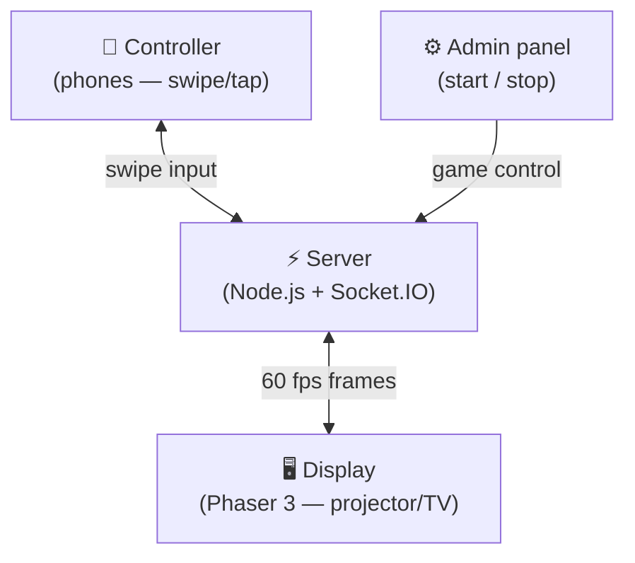

# ⚡ Neon Survival Bumper Cars

Multiplayer WebSocket party game for live events. One shared display (projector/TV), players join from their phones via QR code, an admin controls the match.

## Architecture



**Endpoints:**

| Path | Purpose |
|---|---|
| `/display.html` | Main arena — fullscreen on projector/TV |
| `/controller.html` | Mobile controller — scanned via QR |
| `/admin.html` | Start/stop the game (password: `demo123`) |

## Development (live-reload, no rebuilds)

Source files are mounted as volumes into the container — edit `server.js` or anything in `public/`, nodemon restarts automatically. Nothing is installed on the host.

```bash
# First time only: build the dev image
podman compose --profile dev build

# Start dev server (live-reload)
podman compose --profile dev up dev

# That's it — edit files, save, browser auto-reconnects
```

## Production

```bash
# Build
podman build -t neon-bumper-cars .

# Run (detached, auto-restart)
podman run -d \
  --name neon-bumper-cars \
  --restart unless-stopped \
  -p 3000:3000 \
  -e PORT=3000 \
  neon-bumper-cars

# Logs
podman logs -f neon-bumper-cars

# Stop / remove
podman stop neon-bumper-cars
podman rm neon-bumper-cars
```

### Persist across reboots (systemd)

```bash
podman generate systemd --name neon-bumper-cars --new --files
mkdir -p ~/.config/systemd/user
mv container-neon-bumper-cars.service ~/.config/systemd/user/
systemctl --user daemon-reload
systemctl --user enable --now container-neon-bumper-cars
loginctl enable-linger $(whoami)
```

## Local HTTPS (Cloudflare Tunnel)

Mobile haptics and AudioContext require HTTPS. Cloudflare Tunnel gives you a public HTTPS URL — real cert, no config, no account needed.

```bash
brew install cloudflared
cloudflared tunnel --url localhost:3000
```

Prints a URL like `https://something-random.trycloudflare.com`. The QR on the display adapts automatically via `window.location.origin`.

## Gameplay

1. Open `/display.html` on a projector or large screen.
2. Players scan the QR code (or navigate to `/controller.html`).
3. Admin opens `/admin.html`, enters password `demo123`, hits **Start Game**.
4. Players swipe to move (Manhattan 4-way). **Tap to shoot** — fires in all 4 directions at once (10 shots per spawn, refilled when you rejoin). Collect food/drink emoji coins (+10 pts), avoid bumping other players (−1 life each). 3 lives total, 2s spawn invulnerability.
5. Watch out for **robot bots** (🤖👾) — they chase the nearest player and deal damage on contact! Shoot them to teleport them away.
6. Last player standing wins — or highest score when admin stops the game.

## Source layout

| Path | Purpose |
|---|---|
| `server.js` | Express + Socket.IO entry point, game loop |
| `src/config.js` | All constants and emoji/name data pools |
| `src/game.js` | Pure game-logic functions (collision, spawn, obstacles) |
| `src/bot.js` | Bot AI (`isBotDirBlocked`, `updateBotAI`) |
| `test/game.test.js` | Unit tests for `src/game.js` |
| `test/bot.test.js` | Unit tests for `src/bot.js` |
| `public/` | Client HTML (display, controller, admin) |

## Tests

```bash
# Run tests + coverage (Podman — no host deps)
podman compose --profile test run --rm test
```

Coverage targets: 100% functions, ≥99% statements across `src/`.

## Features

- **Emoji players** — random people, animals, and vehicles (curated for projector visibility); your emoji + name shown large on your phone
- **Robot bots** — 2 AI chasers (🤖👾) with red particle trails and a pulsing red square aura so they're instantly recognisable
- **Shooting** — tap to fire in all 4 directions at once; 10 shots per spawn, refilled on rejoin
- **Food/drink coins** — count scales with players (1 coin per 2 alive players, min 1); always-pulsing glow, staggered per coin
- **Spawn invulnerability** — 2s immunity on join and rejoin so you can't be killed immediately
- **Terrain background** — lightweight tiled ground texture with faint emoji patches
- **Zero external assets** — obstacles are emoji (🌲🪨💧), audio is Web Audio API oscillators, particles are Phaser-generated
- **60 FPS server loop** with AABB collision, 2s invulnerability cooldown
- **Adaptive render resolution** — display canvas scales to native pixels on HD, 2K, 4K, and Retina displays; emojis stay sharp at any screen size
- **Wrap-around arena** (1920×1080) — exit one side, appear on the other
- **Leaderboard** — live rank, score, lives, and remaining shots for each player
- **Containerized** — always runs in Podman, host filesystem is code-only (mounted as volumes in dev)
- **Debug logging** — server and controller log join flow for troubleshooting

## License

MIT — © 2026 carlok
