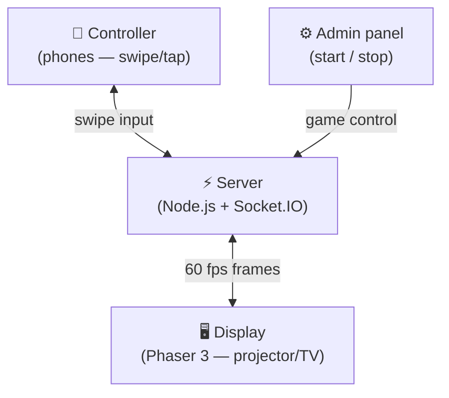

# ⚡ Neon Survival Bumper Cars

Multiplayer WebSocket party game for live events. One shared display (projector/TV), players join from their phones via QR code, an admin controls the match.

## Architecture



**Endpoints:**

| Path | Purpose |
|---|---|
| `/display.html` | Main arena — fullscreen on projector/TV |
| `/controller.html` | Mobile controller — scanned via QR |
| `/admin.html` | Start/stop the game (dev default password `demo123`; production requires `ADMIN_PASSWORD` from env — see `.env.example`) |

## Development (live-reload, no rebuilds)

Source files are mounted as volumes into the container — edit `server.js` or anything in `public/`, nodemon restarts automatically. Nothing is installed on the host.

```bash
# First time only: build the dev image
podman compose --profile dev build

# Start dev server (live-reload)
podman compose --profile dev up dev

# That's it — edit files, save, browser auto-reconnects
```

### Rebuild / reload after Dockerfile or dependency changes

`package.json`, `Dockerfile.dev`, or `Dockerfile` changes require a **new image** before the next `up` or `run`:

```bash
podman compose --profile dev build
podman compose --profile dev up dev

# Tests image
podman compose --profile test build test
podman compose --profile test run --rm test
```

Stop a running dev stack with `Ctrl+C` or `podman compose --profile dev down`.

## Production

```bash
# Build
podman build -t neon-bumper-cars .

# Run (detached, auto-restart). Production images set NODE_ENV=production;
# you must pass a strong ADMIN_PASSWORD (not demo123).
podman run -d \
  --name neon-bumper-cars \
  --restart unless-stopped \
  -p 3000:3000 \
  -e PORT=3000 \
  -e ADMIN_PASSWORD='your-secret-here' \
  neon-bumper-cars

# Logs
podman logs -f neon-bumper-cars

# Stop / remove
podman stop neon-bumper-cars
podman rm neon-bumper-cars
```

For `podman compose up` (default `neon-bumper-cars` service): copy `.env.example` to `.env` and set a strong `ADMIN_PASSWORD`. Compose loads `.env` via `env_file` (optional, Compose v2.24+) so you do not need shell exports or `${VAR}` interpolation warnings. The app refuses to start in production without a valid password.

### Persist across reboots (systemd)

```bash
podman generate systemd --name neon-bumper-cars --new --files
mkdir -p ~/.config/systemd/user
mv container-neon-bumper-cars.service ~/.config/systemd/user/
systemctl --user daemon-reload
systemctl --user enable --now container-neon-bumper-cars
loginctl enable-linger $(whoami)
```

## Local HTTPS (Cloudflare Tunnel)

Mobile haptics and AudioContext require HTTPS. Cloudflare Tunnel gives you a public HTTPS URL — real cert, no config, no account needed.

```bash
brew install cloudflared
cloudflared tunnel --url localhost:3000
```

Prints a URL like `https://something-random.trycloudflare.com`. The QR on the display adapts automatically via `window.location.origin`.

## Gameplay

1. Open `/display.html` on a projector or large screen.
2. Players scan the QR code (or navigate to `/controller.html`).
3. Admin opens `/admin.html`, enters password (`demo123` in dev; production uses `ADMIN_PASSWORD` from env), hits **Start Game**.
4. Players swipe to move (Manhattan 4-way). **Shooting (server rules):** a tap emits `shoot`. The server only fires while the match is **PLAYING** and you are **alive**; otherwise it may ack with `rejected: 'state'`. You need **`shotsLeft` above zero** (10 after each spawn/rejoin); at **0 ammo** you get a `shot-fired-ack` with `shotsLeft: 0` and **no** bullets. Between shots there is an **800 ms** cooldown from `lastShotAt`; taps inside that window ack with `rejected: 'cooldown'` and **do not** spend ammo. On a real shot the server decrements ammo and spawns **4 cardinal bullets** (speed **10** world units per tick at 60 Hz). Bullets despawn when their traveled distance exceeds **600** world units **or** they leave the arena bounds; they can **hit obstacles** (bullet removed), **other players** (not the owner), and **robot bots** (bots respawn to their grid home). You **cannot** damage yourself (owner id is skipped). Collect food/drink emoji coins (+10 pts), avoid bumping other players (−1 life each). 3 lives total, 2s spawn invulnerability.
   - Obstacle count scales automatically with player count: fewer obstacles for large crowds, more for small groups (formula: `max(4, 20 − ⌊players/2⌋)`).
   - **Autoplay mode** (admin "🤖 Autoplay (32)" button): spawns 32 random-walk bots as regular players — useful for stress-testing the server at max capacity.
5. Watch out for **robot bots** (🤖👾) — they spawn on a **fixed grid** of cells so they do not overlap at rest; they chase the nearest player and deal damage on contact. Shoot them to send them back to their home cell (or a safe fallback if that cell is blocked).
6. Last player standing wins — or highest score when admin stops the game.

## Source layout

| Path | Purpose |
|---|---|
| `server.js` | Express + Socket.IO entry point, game loop |
| `src/config.js` | All constants and emoji/name data pools |
| `src/game.js` | Pure game-logic functions (collision, spawn, obstacles) |
| `src/displayCalibrate.js` | Display calibration: arena column count, output resolution fit, sidebar-aware camera zoom, `computeDisplayCameraZoom` (legacy cell-base math); mirrored in `public/display.html` |
| `src/bot.js` | Bot AI (`isBotDirBlocked`, `updateBotAI`) |
| `test/game.test.js` | Unit tests for `src/game.js` |
| `test/bot.test.js` | Unit tests for `src/bot.js` |
| `test/config.test.js` | Production `ADMIN_PASSWORD` guard |
| `scripts/assert-podman-tests.js` | Host `npm test` guard — use Podman `test` service |
| `.env.example` | Template for Compose / local prod (`cp` → `.env`) |
| `public/` | Client HTML (display, controller, admin) |

## Tests

**Do not run `npm test` on the host** — it exits with instructions. Use Podman only:

```bash
# Run tests + coverage (Podman — no host Node/Jest)
podman compose --profile test run --rm test
```

Coverage is run on `src/**/*.js`. Line and statement coverage for all listed files is **100%** in CI; branch coverage is slightly lower on `displayCalibrate.js` and `game.js` (complex conditionals). The `test` compose service bind-mounts `package.json` so the printed npm version matches your tree without rebuilding on version-only bumps.

## Features

- **Emoji players** — random people, animals, and vehicles (curated for projector visibility); your emoji + name shown large on your phone
- **Robot bots** — 2 AI chasers (🤖👾) on rigid grid slots (no spawn overlap); red trails + pulsing aura
- **Shooting** — tap emits `shoot`; server enforces PLAYING + alive + ammo + 800 ms cooldown; acks carry `shotsLeft` and optional `rejected` (`state` / `cooldown`); 4 bullets at 10 world units/tick, max travel 600 or off-arena; hits obstacles, other players, and bots (not owner)
- **Adaptive obstacles** — obstacle count scales inversely with player count (`max(4, 20 − ⌊n/2⌋)`); regenerated fresh each time the game starts
- **Autoplay stress-test** — admin panel "🤖 Autoplay (32)" fills the arena with 32 random-walk fake players to verify server performance at capacity
- **Food/drink coins** — count scales with players (1 coin per 2 alive players, min 1); always-pulsing glow, staggered per coin
- **Spawn invulnerability** — 2s immunity on join and rejoin so you can't be killed immediately
- **Terrain background** — lightweight tiled ground texture with faint emoji patches
- **Zero external assets** — obstacles are emoji (🌲🪨💧), audio is Web Audio API oscillators, particles are Phaser-generated
- **60 FPS server loop** with AABB collision, 2s invulnerability cooldown
- **Adaptive render resolution** — Phaser internal buffer scales with device pixel ratio and the CSS size of `#phaser-root` so emojis stay sharp on HD / 2K / 4K / Retina
- **Display output resolution (admin)** — Admin picks a **preset** (720p … 8K) and **Set** (password); the server broadcasts `display-config` to all `/display.html` clients. The display page sizes **`#phaser-root`** to the **fitted** 16:9 size for that preset, **clamped** to the browser window, then Phaser **Scale.FIT** fills that box — so Full HD vs 4K presets change the **physical** scale on the projector, not only the numbers in the admin hint
- **Arena column zoom (env)** — `ARENA_COLUMNS` (or server default, **8–40**) sets how many **40**-world-unit strips should be visible across the **arena** (not the full 1920-wide layout). Zoom is **sidebar-aware**: `1920 / (40×cols + 320)` so the visible arena width matches **`40×cols`** while the **320**-unit leaderboard/QR column stays on screen when **zoom > 1** (`displayZoomForArenaColumns`, `displayCameraCenterX` in `src/displayCalibrate.js`, mirrored in `public/display.html`). Admin feedback shows **~px per 40wu cell** using the **arena slice** only: `fittedWidth × (1600/1920) / cols`
- **`computeDisplayCameraZoom` (library)** — Optional cell-base calibration (`cellBasePx` on arena CSS width → zoom **0.2–16**); still exported for tooling/tests; the live display path uses **column count + resolution preset** above
- **Wrap-around arena** (1600×1080 logical) — exit one side, appear on the other
- **Leaderboard** — live rank, score, lives, and remaining shots for each player
- **Containerized** — always runs in Podman, host filesystem is code-only (mounted as volumes in dev)
- **Debug logging** — server and controller log join flow for troubleshooting

## License

MIT — © 2026 carlok
